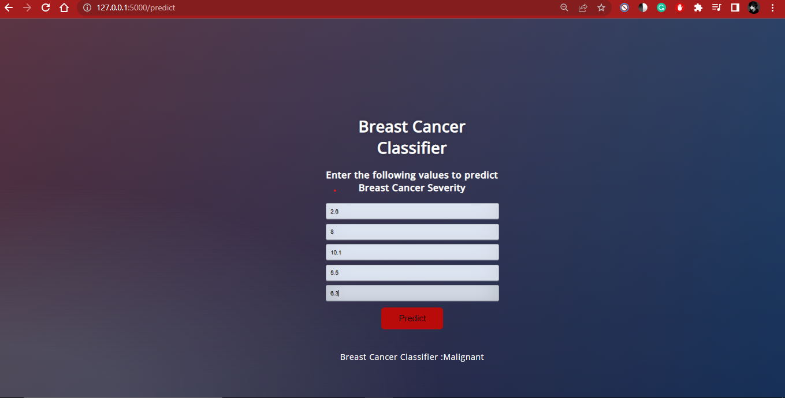

# BreastCancer
 

    
 
        ## Steps to run
    

    
    
    ### 1.> Set up venv
    ### 2.> Set Flask
        set FLASK_ENV=development
        set FLASK_APP=app
    ### 3.> Run Flask
        flask run

 

# output : 

